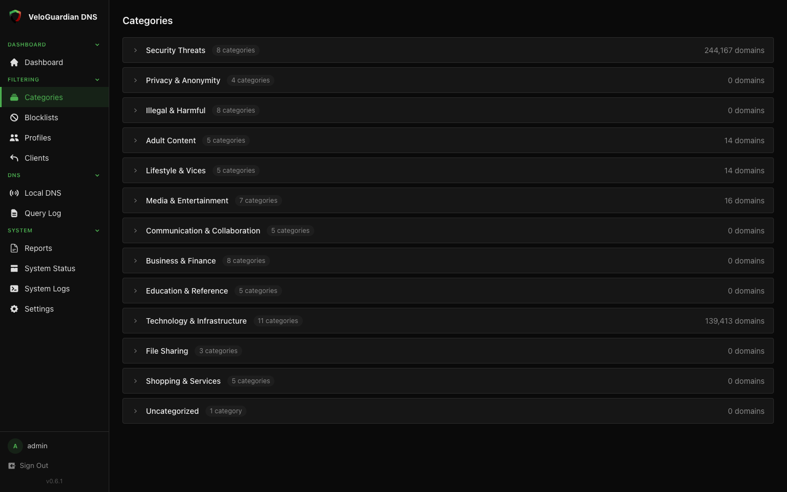
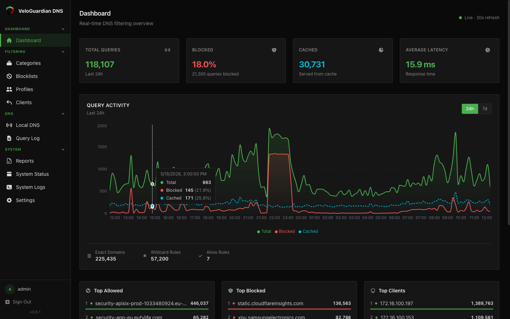
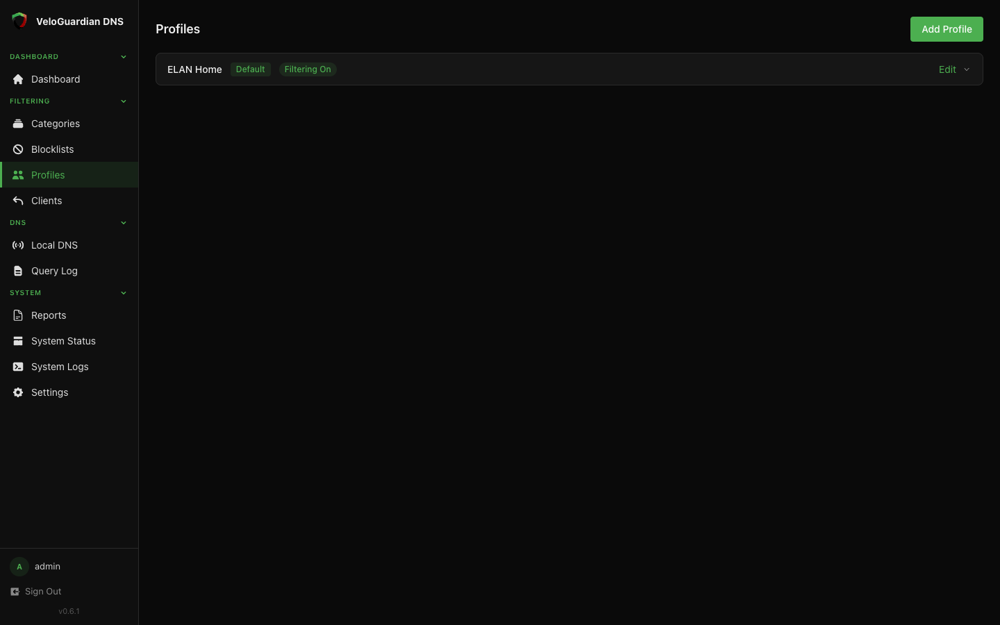
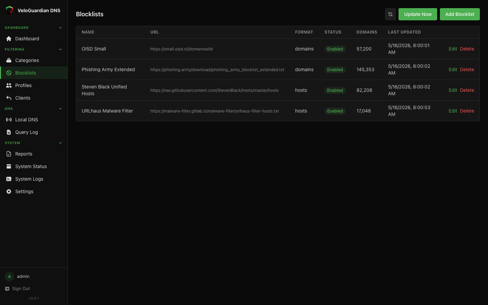
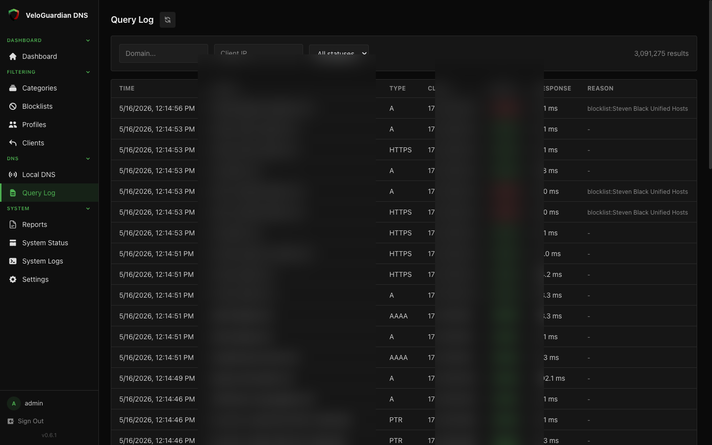
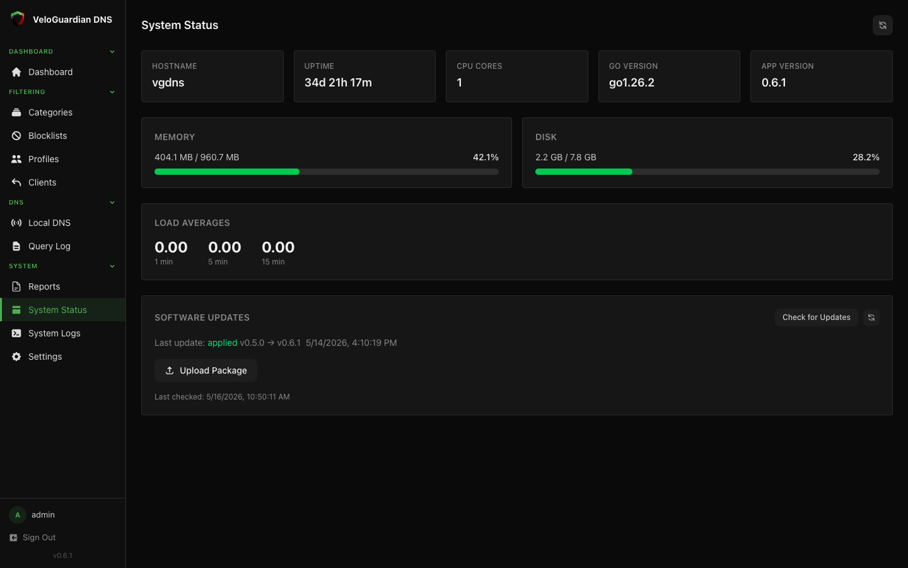
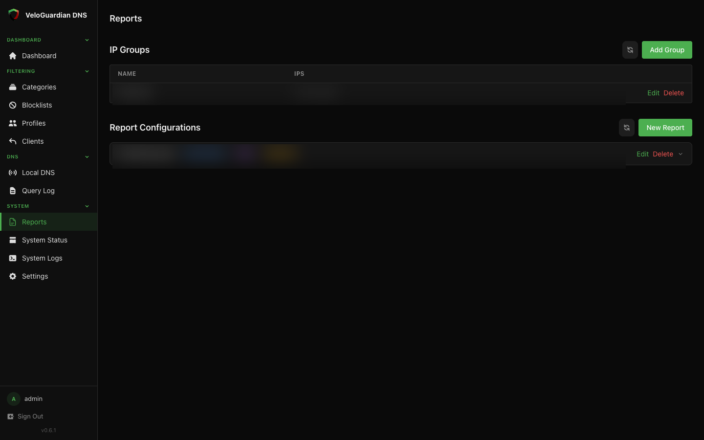
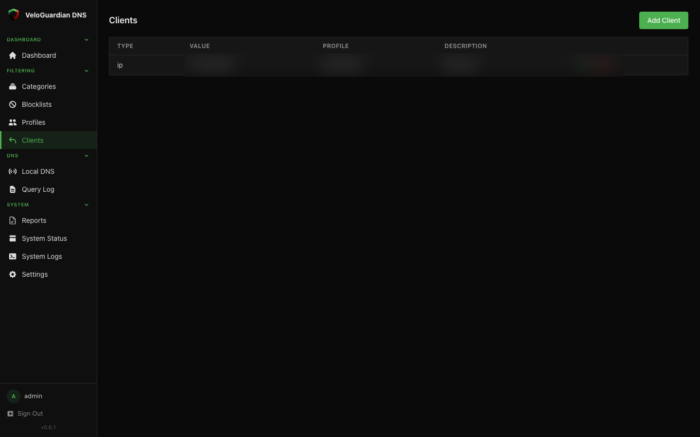

# VeloGuardian DNS

**Free, self-hosted DNS filtering appliance for your network.**

VeloGuardian DNS is a virtual appliance that filters DNS queries at the network layer. Deploy it once on your LAN, point your router's DNS to it, and every device on your network is protected — phones, smart TVs, game consoles, IoT — without installing anything on each device.

It is distributed as either a hardened **OVA virtual machine** (boots ready to go on VMware, VirtualBox, Proxmox, Hyper-V) or a **Debian/Ubuntu installer tarball** for installing on a host you already manage. No account is required, there is no cloud dependency, and the product is free in both senses (cost and ad-free).



> *The Categories page in v0.6.1 — 13 groups, 75 categories, with live per-group domain counts. The full taxonomy is the [VeloGuardian Argos](#filtering-taxonomy) standard.*

## Why VeloGuardian DNS

|  | VeloGuardian DNS | Pi-hole | AdGuard Home | NextDNS | Cloudflare 1.1.1.3 |
|---|:---:|:---:|:---:|:---:|:---:|
| Self-hosted | ✓ | ✓ | ✓ | — | — |
| Ships as a hardened appliance | ✓ | — | — | n/a | n/a |
| Web dashboard | ✓ | ✓ | ✓ | ✓ | — |
| Built-in category taxonomy | 75 categories / 13 groups | community blocklists only | yes | yes | malware + adult presets only |
| Per-client filtering profiles | ✓ | groups | per-client | per-device | — |
| Scheduled PDF reports | ✓ | — | — | — | — |
| Signed in-place updates | ✓ | manual `apt` | manual | n/a | n/a |
| Account required | no | no | no | yes | no |

See the longer-form comparison at [veloguardian.com/veloguardian-dns-vs-pihole-nextdns.html](https://veloguardian.com/veloguardian-dns-vs-pihole-nextdns.html).

## Install

Three paths, in order of "easiest" to "most flexible". Pick one.

### 1. OVA virtual machine — canonical

Download the OVA, import it into your hypervisor, walk through the console wizard. Two published filenames, same bytes:

```sh
# Latest (overwritten in place with each release — easiest)
curl -LO https://www.veloguardian.com/downloads/VeloGuardianDNS.ova
curl -LO https://www.veloguardian.com/downloads/VeloGuardianDNS.ova.sha256
sha256sum -c VeloGuardianDNS.ova.sha256

# Versioned mirror (use this URL if you want a reproducible reference to a specific release)
curl -LO https://www.veloguardian.com/downloads/VeloGuardianDNS-0.6.1.ova
curl -LO https://www.veloguardian.com/downloads/VeloGuardianDNS-0.6.1.ova.sha256
sha256sum -c VeloGuardianDNS-0.6.1.ova.sha256
```

The appliance also self-updates in place — once installed, the in-app updater (Console option 7, or the System Status page) pulls signed `.vgupdate` packages from the official server. So even if you import an older OVA in the future, the appliance will offer to upgrade itself to the latest binary on first boot.

Full step-by-step in [INSTALL.md](INSTALL.md#ova-virtual-machine).

### 2. Installer tarball — for an existing Debian 12 / Ubuntu 22.04+ host

If you already manage a Linux box (a Raspberry Pi 4, a VM you spun up yourself, a dedicated low-power machine), this is the smallest footprint.

```sh
curl -sSLO https://www.veloguardian.com/downloads/veloguardian-dns-0.6.1-linux-amd64.tar.gz
curl -sSLO https://www.veloguardian.com/downloads/veloguardian-dns-0.6.1-linux-amd64.tar.gz.sha256
sha256sum -c veloguardian-dns-0.6.1-linux-amd64.tar.gz.sha256
tar -xzf veloguardian-dns-0.6.1-linux-amd64.tar.gz
cd veloguardian-dns-0.6.1
sudo ./install.sh
```

The installer creates a `vgdns` system user, installs the binary under `/opt/veloguardian-dns/`, drops the default config at `/etc/vgdns/config.yaml`, registers the `vgdns.service` systemd unit, opens DNS (port 53/udp+tcp) and the dashboard (port 8080/tcp), and starts the service.

After install, open `http://<host-ip>:8080/` and log in as `admin` / `admin`. The first thing the dashboard will prompt you to do is change the password.

Full step-by-step in [INSTALL.md](INSTALL.md#installer-tarball).

### 3. Try it for 60 seconds via qemu

If you just want to take it for a spin without touching your real network or hypervisor, the eval script in [`eval/`](eval/) launches the OVA inside a throwaway qemu VM bound to localhost only.

```sh
cd eval
./qemu-eval.sh
# wait ~30 seconds, then open http://localhost:8080/
```

The VM is reachable only from your machine and is destroyed when you kill the script. Zero impact on your real network. See [eval/README.md](eval/README.md) for details.

## Screenshots

| | |
|---|---|
|  |  |
| **Dashboard** — query volume, blocked %, cache hit rate, latency, 24h activity chart with per-hour breakdown | **Categories** — 13 Argos groups (75 categories total), expandable, with live per-group domain counts |
|  |  |
| **Profiles** — per-client filtering policies with custom allow/deny rules and time-based schedule overrides | **Blocklists** — curated blocklists (Steven Black hosts, OISD, Phishing Army, URLhaus) plus your own URL imports |
|  |  |
| **Query Log** — real-time, filterable per-query log with client IP, domain, status, category, and latency | **System Status** — uptime, CPU/memory/disk, hostname, version, online-update check + apply |
|  |  |
| **Reports** — scheduled PDF reports (24h / 7d / 30d / custom), per-client or IP-group scoping, SMTP delivery, retention | **Clients** — explicit client-to-profile mappings (by IP, subnet, MAC, or hostname); falls back to a default profile |

## Filtering taxonomy

The category taxonomy is **VeloGuardian Argos** — the same classification standard used across every VeloGuardian product. 13 groups, 75 categories.

| Group | Categories | Examples |
|---|:---:|---|
| Security Threats | 8 | Malware, Phishing, Botnet, Cryptojacking, Spam |
| Privacy & Anonymity | 4 | VPN, Proxy, Tor, Web Anonymizer |
| Illegal & Harmful | 8 | Hacking Tools, Terrorism, Extremism, Weapons |
| Adult Content | 5 | Pornography, Nudity, Dating |
| Lifestyle & Vices | 5 | Gambling, Alcohol, Tobacco, Cannabis |
| Media & Entertainment | 7 | Streaming Video, Gaming, Social Media, News |
| Communication & Collaboration | 5 | Email, Messaging, Video Conferencing, Forums |
| Business & Finance | 8 | Banking, Trading, Cryptocurrency, Government |
| Education & Reference | 5 | Schools, Health, Research |
| Technology & Infrastructure | 11 | Search Engines, Advertising, Analytics, Cloud Services |
| File Sharing | 3 | Cloud Storage, File Transfer, Peer-to-Peer |
| Shopping & Services | 5 | E-commerce, Travel, Food Delivery |
| Uncategorized | 1 | Entries not yet classified |

You assign categories to profiles (e.g., a Sentry profile that blocks only Security Threats, a Citadel profile that also blocks Adult Content and Lifestyle & Vices) and assign clients to profiles by IP, subnet, MAC, or hostname.

## Blocklists

The appliance ships with four curated blocklists enabled by default:

| Blocklist | Source | Categories | Approximate size |
|---|---|---|---|
| Steven Black — Unified Hosts | [github.com/StevenBlack/hosts](https://github.com/StevenBlack/hosts) | ads, malware | ~190K domains |
| OISD Small | [oisd.nl](https://oisd.nl/) | advertising | ~70K domains |
| Phishing Army Extended | [phishing.army](https://phishing.army/) | phishing | ~28K domains |
| URLhaus Malware Filter | [urlhaus.abuse.ch](https://urlhaus.abuse.ch/) | malware | ~3K domains |

Add your own under **Filtering → Blocklists**. Supported formats: `hosts` (Steven-Black style), `domains` (one domain per line), and `adblock` (EasyList style — conservative rule extraction; only exact-domain entries are honored).

See [blocklists/](blocklists/) for a curated set of recommended community blocklists you can copy-paste into the dashboard.

## Documentation

Source-of-truth documentation lives on the VeloGuardian website:

- [Quick Start Guide](https://veloguardian.com/docs/dns/quick-start.html) — install, first-boot configuration, point your router
- [Dashboard Guide](https://veloguardian.com/docs/dns/dashboard.html) — every page walked through
- [Blocklists, categories, profiles, schedules](https://veloguardian.com/docs/dns/blocklists.html) — the full filtering model
- [Console CLI reference](https://veloguardian.com/docs/dns/console-cli.html) — every menu item on the appliance console
- [What is DNS filtering?](https://veloguardian.com/what-is-dns-filtering.html) — background explainer
- [VeloGuardian DNS vs Pi-hole, AdGuard Home, NextDNS, Cloudflare](https://veloguardian.com/veloguardian-dns-vs-pihole-nextdns.html) — side-by-side comparison

In this repo:

- [INSTALL.md](INSTALL.md) — detailed install procedures for both OVA and tarball, with troubleshooting
- [CHANGELOG.md](CHANGELOG.md) — release history with what changed in each version
- [blocklists/](blocklists/) — sample community blocklist configs
- [eval/](eval/) — qemu eval harness for trying the appliance without touching real infrastructure

## Feedback & support

- **Bug reports** — [Open an issue](https://github.com/veloguardian/community/issues/new?template=dns-bug-report.yml)
- **Feature requests** — [Submit an idea](https://github.com/veloguardian/community/issues/new?template=dns-feature-request.yml)
- **Questions, install help, general discussion** — [GitHub Discussions](https://github.com/veloguardian/community/discussions) or [open a question issue](https://github.com/veloguardian/community/issues/new?template=general-question.yml)
- **Release notes** — [CHANGELOG.md](CHANGELOG.md)

## What this repository is (and is not)

This repository is the **public-facing community surface** for VeloGuardian DNS: documentation, install assets, sample blocklists, an eval harness, issue templates, and a changelog. It exists so you can find and evaluate the product on GitHub, file issues, and collaborate on community blocklist configurations.

The appliance source code is **proprietary** and not published here. If you want to inspect what runs inside the appliance, the binary is reproducibly built and the update package is Ed25519-signed; verify the published signature against the public key embedded in the appliance (printed in [INSTALL.md](INSTALL.md#verifying-signatures)).

## License

The contents of this repository (documentation, sample configs, eval scripts, screenshots) are released under [CC0 1.0 Universal](https://creativecommons.org/publicdomain/zero/1.0/) — copy, modify, redistribute freely. The VeloGuardian DNS appliance itself is a separate proprietary product; see [veloguardian.com](https://veloguardian.com) for product terms.
